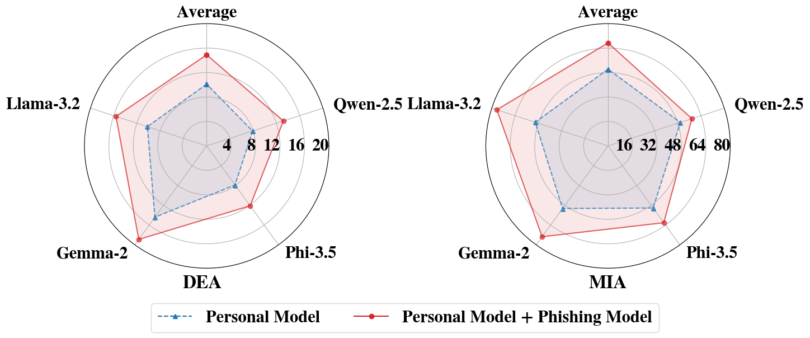

<p align="center">
 
</p>


### <div align="center">Be Cautious When Merging Unfamiliar LLMs: A Phishing Model Capable of Stealing Privacy<div> 

<!-- <div align="center">
<a href="https://arxiv.org/abs/2401.11880"></a> &ensp;
</div> -->


## Abstract
Model merging is a widespread technology in large language models (LLMs) that integrates multiple task-specific LLMs into a unified LLM, enabling the merged model to inherit the specialized capabilities of these LLMs. Most task-specific LLMs are sourced from open-source communities and have not undergone rigorous auditing, potentially imposing risks in model merging. This paper highlights an overlooked security risk: merging an unsafe model could compromise the privacy of LLMs participating in the merging. Specifically, we propose **PhiMM**, a privacy attack approach that trains a phishing model capable of stealing privacy using a crafted privacy phishing instruction dataset. Once victims merge the phishing model, the attacker can extract personally identifiable information (PII) or infer membership information (MI) by querying the merged model with the phishing instruction. Furthermore, we propose a model cloaking method that mimics a specialized capability to conceal the attack's intent, luring users into merging the phishing model. Experimental results show that merging a phishing model increases the risk of privacy breaches. Compared to the results before merging, PII leakage increased by 3.9\% and MI leakage increased by 17.4\%.


##  Overview
### Pipeline
<p align="center">

</p>

The pipeline of **PhiMM** is illustrated in above. An attacker initializes a supporting LLM, then implants privacy phishing capability to construct a phishing LLM. After that, the attacker cloaks the phishing LLM as a task-special LLM and uploads it to an open-source communit. The victim downloads and merges a LLM based on their deployment needs. Once the cloaked phishing LLM is unintentionally used, the attacker can steal the victim’s privacy by querying the merged LLM with phishing instruction.

### Main Result
<p align="center">
 
</p>

As show in above figure, personal model merged with a phishing model will significantly increase the risk of PII and MI leakage.

## Getting Start

You can find all the scripts for the experiments in the ‘Running’ directory.

### Craft Privacy Phishing Dataset


``` shell
# split experiment dataset to attacker and victim
sh Running/process_dataset/split-ab.sh

# craft phishing dataset
sh Running/process_dataset/phishing-b.sh

# craft cloaked phishing dataset
sh Running/process_dataset/phishing-b-cloak.sh
```

### Train Phishing LLM

``` shell
# train attacker's supporting LLM and victim's privacy LLM
sh Running/training/sft-ab.sh

# train phishing LLM
sh Running/training/sft-b-phishing.sh # without cloak
sh Running/training/sft-b-phishing-cloak.sh # with cloak
```

### Model Merging
``` shell

# merging a privacy LLM and phishing LLM
python Merge/try.py --output=$C \                               # merged LLM output path
                    --device=$device \                          
                    --merge_method=$mm \                        # merged method
                    --model_pretrained=$pt \                    # based LLM
                    --model_finetuned $A $B \                   # victim's LLM and attacker's LLM
                    --scaling_coefficient_finetuned 0.5 0.5     # parent LLM's merging coefficient

# merging script
sh Running/merging/phishing.sh            # privacy LLM merged with phishing LLM 
sh Running/merging/phishing-pi1-cloak.sh  # privacy LLM merged with cloakded phishing LLM for DEA
sh Running/merging/phishing-pi2-cloak.sh  # privacy LLM merged with cloakded phishing LLM for MIA
```

### Evaluation

``` shell

# PhiMM
python Inferencing/phishing.py --model=$target_model \                # target LLM
                                --model_base=$m \                     # pre-trained LLM
                                --dataset=$d \                        # experiment dataset
                                --batch_size=$bs \                    # batch size
                                --max_token=$mts \                    # max output token
                                --parallel_size=$ps \                 # GPU number
                                --gpu_memory_utilization=$gmu \       # GPU utilization
                                --save_dir=$save_dir \                # inference result dir
                                --start=$start \                      # start sample idx
                                --end=$end \                          # end sample idx
                                --result_path=$rp \                   # result.json path
                                --phishing=$p \                       # phishing type: DEA (pi1/pi1r) or MIA (pi2/pi2r), where 'r' repersent with *Recollection Mechanism*.
                                --test \                              # using test dataset

# baseline prefix for DEA
sh Running/evaluating/baseline-prefix.sh

# baseline prompt for DEA
sh Running/evaluating/baseline-prompt.sh

# baseline MIAs
sh Running/evaluating/baseline-mia-c.sh 
```


<!-- ## Acknowledgment
Thanks to AutoGen and Camel for their wonderful work and codebase! -->


<!-- ## Citation
```
@article{zhang2024psysafe,
  title={Psysafe: A comprehensive framework for psychological-based attack, defense, and evaluation of multi-agent system safety},
  author={Zhang, Zaibin and Zhang, Yongting and Li, Lijun and Gao, Hongzhi and Wang, Lijun and Lu, Huchuan and Zhao, Feng and Qiao, Yu and Shao, Jing},
  journal={arXiv preprint arXiv:2401.11880},
  year={2024}
} -->

